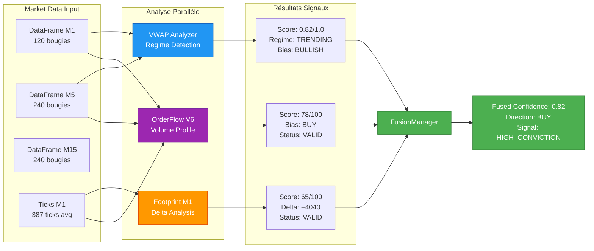
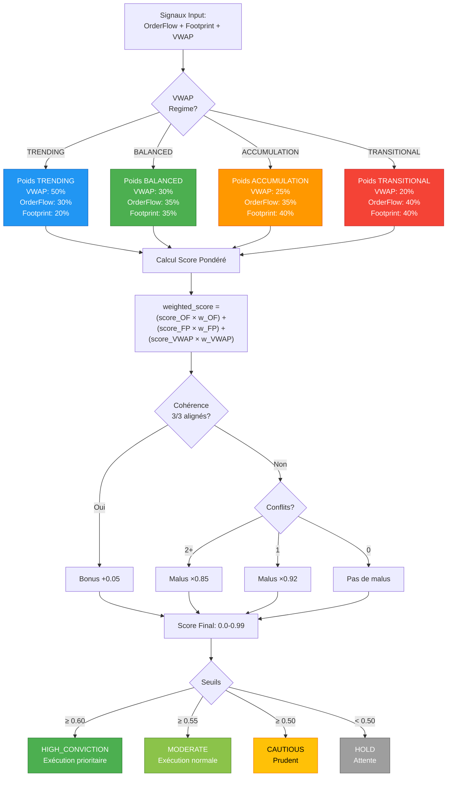
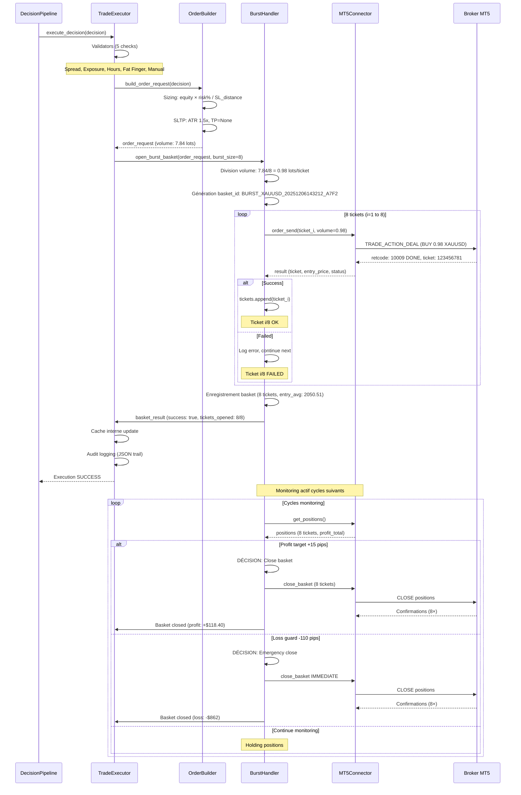
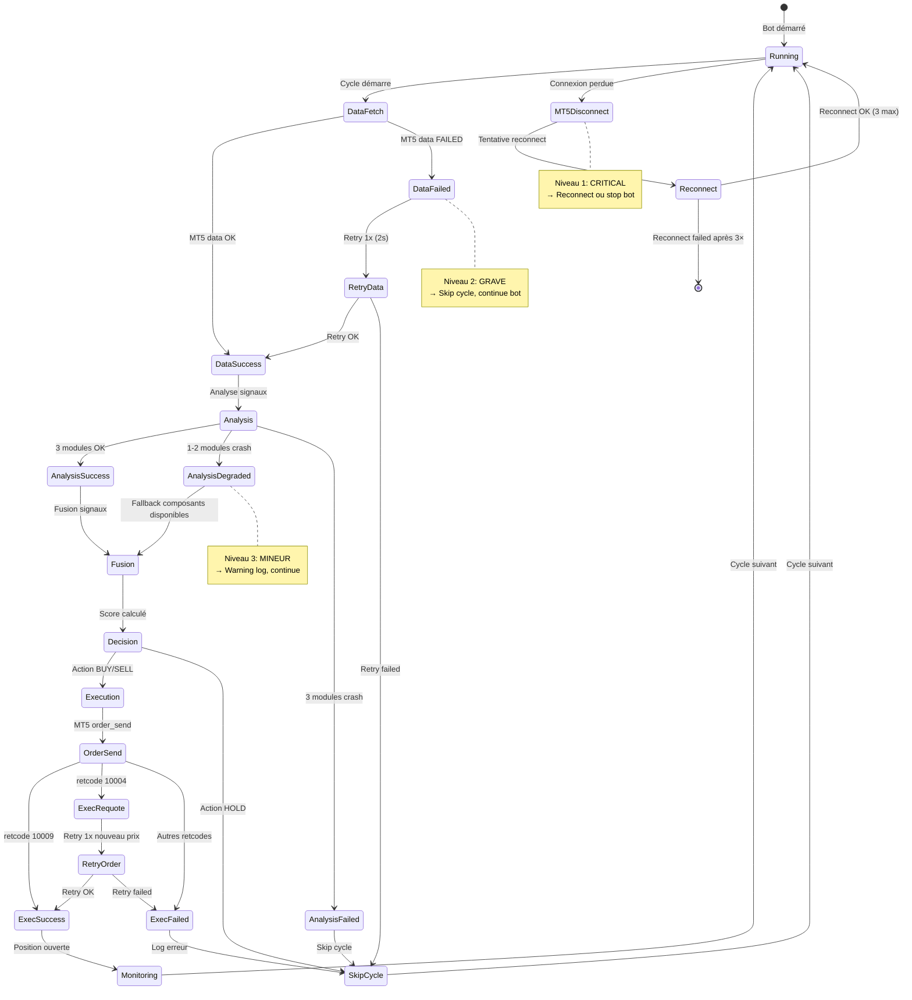
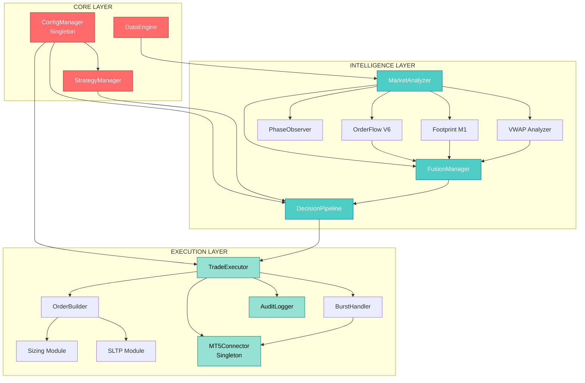

# DIAGRAMME PIPELINE SNIPER_X - Mermaid
## Visualisation Interactive du Pipeline de Trading

**Version:** 1.0
**Date:** 6 Décembre 2025

---

## INSTRUCTIONS D'UTILISATION

Ce document contient des diagrammes **Mermaid** qui peuvent être visualisés de plusieurs façons:

1. **GitHub/GitLab:** Rendu automatique dans l'interface web
2. **VS Code:** Extension "Markdown Preview Mermaid Support"
3. **Mermaid Live Editor:** https://mermaid.live (copier-coller le code)
4. **Obsidian:** Rendu natif dans les notes markdown

---

## 1. PIPELINE COMPLET (VUE GLOBALE)

```mermaid
graph TB
    Start([Bot Démarrage<br/>main.py]) --> Init[PHASE INITIALISATION<br/>ConfigManager + MT5Connector<br/>StrategyManager + DecisionPipeline]

    Init --> Verify{Vérifications<br/>Pré-démarrage}
    Verify -->|❌ Échec| Stop([STOP BOT<br/>Alert Telegram])
    Verify -->|✅ OK| Loop[Alignement Horloge Suisse<br/>sleep_until_next_minute]

    Loop --> CycleStart[CYCLE N démarré<br/>Timestamp exact]

    CycleStart --> DataCollect[A. MARKET DATA COLLECTION<br/>MT5: OHLC M1/M5/M15 + Ticks]

    DataCollect --> SignalGen[B. SIGNAL GENERATION<br/>OrderFlow V6 + Footprint + VWAP]

    SignalGen --> Fusion[C. FUSION MANAGER<br/>Poids adaptatifs selon VWAP regime]

    Fusion --> Decision[D. DECISION PIPELINE<br/>Sélection stratégie + Validation]

    Decision --> ValidCheck{E. VALIDATORS<br/>5 checks}
    ValidCheck -->|❌ Rejet| LogSkip[Log raison skip]
    ValidCheck -->|✅ Pass| OrderBuild[F. ORDER BUILDER<br/>Sizing + SL/TP]

    OrderBuild --> ExecCheck{Burst?}
    ExecCheck -->|Oui| BurstExec[G. BURST HANDLER<br/>8 tickets parallèles]
    ExecCheck -->|Non| SingleExec[G. SINGLE EXECUTION<br/>1 ticket]

    BurstExec --> MT5Send[H. MT5 ORDER SEND<br/>mt5.order_send]
    SingleExec --> MT5Send

    MT5Send --> ExecResult{Retcode?}
    ExecResult -->|10009 DONE| Success[✅ Position Ouverte<br/>Cache + Audit + Telegram]
    ExecResult -->|10004 REQUOTE| Retry[Retry 1x<br/>nouveau prix]
    ExecResult -->|Autre| Failed[❌ Échec<br/>Log + Skip]

    Retry --> MT5Send

    Success --> Monitor[I. MONITORING<br/>Burst basket surveillance]
    Failed --> LogSkip
    LogSkip --> NextCycle

    Monitor --> ProfitCheck{Profit target<br/>atteint?}
    ProfitCheck -->|Oui +15 pips| CloseProfit[J. CLOSE BASKET<br/>Profit realized]
    ProfitCheck -->|Non| LossCheck{Loss guard<br/>triggered?}

    LossCheck -->|Oui -110 pips| CloseEmergency[J. EMERGENCY CLOSE<br/>Loss limited]
    LossCheck -->|Non| NextCycle[K. SLEEP UNTIL NEXT MINUTE<br/>60s précis]

    CloseProfit --> Reconcile[L. RECONCILIATION<br/>MT5 positions sync]
    CloseEmergency --> Reconcile

    Reconcile --> AuditLog[M. AUDIT LOGGING<br/>JSON trail complet]

    AuditLog --> NextCycle
    NextCycle --> CycleStart

    style Start fill:#4CAF50,stroke:#2E7D32,color:#fff
    style Stop fill:#F44336,stroke:#C62828,color:#fff
    style Success fill:#4CAF50,stroke:#2E7D32,color:#fff
    style Failed fill:#F44336,stroke:#C62828,color:#fff
    style CloseProfit fill:#4CAF50,stroke:#2E7D32,color:#fff
    style CloseEmergency fill:#FF9800,stroke:#E65100,color:#fff
    style Fusion fill:#2196F3,stroke:#1565C0,color:#fff
```



---

## 2. SIGNAL GENERATION (DÉTAIL MODULE B)



---

## 3. FUSION MANAGER (POIDS ADAPTATIFS)



---

## 4. BURST EXECUTION (8 TICKETS PARALLÈLES)



---

## 5. GESTION ERREURS (RÉCUPÉRATION)



---

## 6. CYCLE DE VIE TRADE (EXEMPLE XAUUSD)

```mermaid
gantt
    title Trade XAUUSD Scalping Burst - Cycle de vie complet
    dateFormat  HH:mm:ss
    axisFormat %H:%M:%S

    section Détection
    Signal generation       :done, s1, 14:32:00, 6s
    Fusion signaux          :done, s2, after s1, 3s

    section Décision
    Validation pré-exec     :done, d1, after s2, 1s
    Construction ordre      :done, d2, after d1, 2s

    section Exécution
    Burst tickets 1-8       :done, e1, 14:32:13, 6s
    Confirmation MT5        :done, e2, after e1, 1s
    Telegram alert          :done, e3, after e2, 1s

    section Monitoring
    Cycle 43 (prix +17)     :active, m1, 14:33:00, 1m
    Cycle 44 (prix +31)     :active, m2, after m1, 1m
    Cycle 45 (prix +44)     :active, m3, after m2, 1m
    Cycle 46 (prix +61)     :active, m4, after m3, 1m
    Cycles 47-56            :active, m5, after m4, 10m
    Cycle 57 (prix +15)     :crit, m6, after m5, 1m

    section Fermeture
    Profit target atteint   :done, c1, 14:47:01, 1s
    Close basket 8 tickets  :done, c2, after c1, 6s
    Reconciliation          :done, c3, after c2, 2s
    Audit logging           :done, c4, after c3, 2s

    section Bilan
    Trade finalisé          :milestone, 14:47:11, 0s
```



---

## 7. ARCHITECTURE MODULES (DÉPENDANCES)



---

## 8. LOGS & AUDIT FLOW

```mermaid
flowchart LR
    subgraph Events[Événements Système]
        E1[Trade Execution]
        E2[Basket Closure]
        E3[Config Change]
        E4[Error Occurred]
        E5[System Event]
    end

    subgraph Loggers[Logging Modules]
        E1 --> TL[TradeLogger]
        E2 --> TL
        E1 --> AL[AuditLogger]
        E2 --> AL
        E3 --> AL
        E4 --> AL
        E5 --> AL
        E4 --> EL[ErrorLogger]
    end

    subgraph Files[Fichiers Logs]
        TL --> F1[(trades_{date}.log<br/>Texte lisible<br/>Retention: 90j)]
        AL --> F2[(audit_{date}.log<br/>JSON Lines<br/>Retention: 365j)]
        EL --> F3[(errors_{date}.log<br/>Traceback full<br/>Retention: 90j)]
        AL --> F4[(audit trail database<br/>Optionnel SQL)]
    end

    subgraph Alerts[Alertes]
        E4 --> T1[Telegram Critical<br/>Erreurs niveau 1]
        E1 --> T2[Telegram Trades<br/>Ouverture/Fermeture]
        E5 --> T3[Telegram Health<br/>Checks 4h]
    end

    style F1 fill:#FFE66D,stroke:#F59F00,color:#000
    style F2 fill:#4ECDC4,stroke:#0B7285,color:#fff
    style F3 fill:#FF6B6B,stroke:#C92A2A,color:#fff
    style F4 fill:#A8DADC,stroke:#1864AB,color:#000

    style T1 fill:#FF6B6B,stroke:#C92A2A,color:#fff
    style T2 fill:#4ECDC4,stroke:#0B7285,color:#fff
    style T3 fill:#95E1D3,stroke:#087F5B,color:#000
```

---

## NOTES D'UTILISATION

### Visualisation Recommandée
1. **Diagramme 1** (Pipeline complet) - Vue globale du flux
2. **Diagramme 4** (Burst execution) - Séquence détaillée burst
3. **Diagramme 3** (Fusion Manager) - Logique scoring adaptatif
4. **Diagramme 5** (Gestion erreurs) - États et récupération

### Légende Couleurs
- 🟢 **Vert** → Succès, état actif
- 🔴 **Rouge** → Erreur, état critique
- 🔵 **Bleu** → Processus normal, intelligence
- 🟠 **Orange** → Warning, état dégradé
- ⚫ **Gris** → Neutre, attente

### Export Formats
Les diagrammes Mermaid peuvent être exportés en:
- **PNG/SVG** (via mermaid.live)
- **PDF** (via pandoc + mermaid-filter)
- **HTML interactif** (via mermaid.js)

---

**Document Version:** 1.0
**Dernière MAJ:** 6 Décembre 2025
**Auteur:** Architecture Team SNIPER_X
**Référence:** ARBRE_GENEALOGIQUE_PROCESSUS.md + RESUME_EXECUTIF.md
